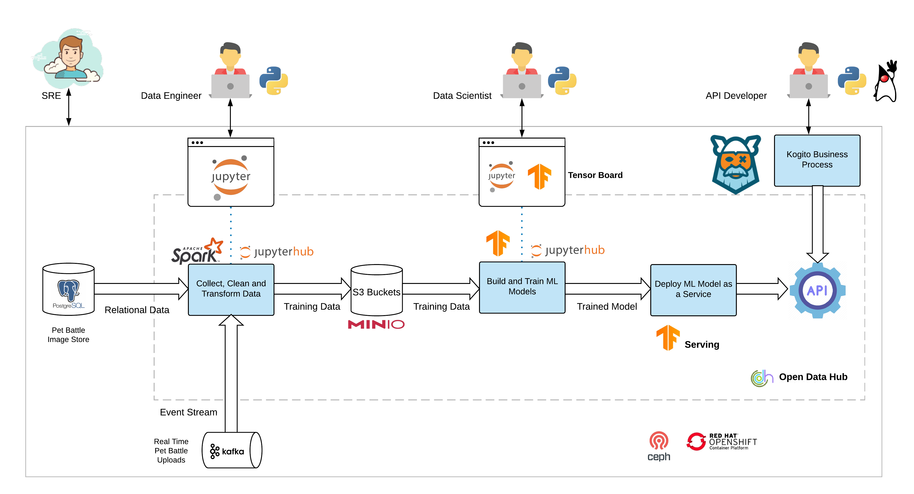

# pet-battle-nsfw

Not safe for work filter for [pet battle app](http://petbattle.app)

Based on [Yahoo's Open NSFW Classifier](https://github.com/yahoo/open_nsfw) rewritten in tensorflow.



## Deploying the Full Example

helm3 deploy of PetBattle onto OpenShift (frontend, api, nsfw)
```
oc new-project pet-battle-nsfw
helm repo add eformat https://eformat.github.io/helm-charts
helm repo update
helm install pb-nsfw eformat/pet-battle-nsfw --version=0.0.2
```

## NSFW Locally

Running in local containers

Minio S3
```bash
cd minio
make podman-run
```
Create a bucket called `models`, login to http://localhost:9000 with default `minioadmin:miniadmin` credentials

Upload pre-built tensorflow model to minio
```bash
cd tensorflow-open_nsfw/tools
export MINIO_SERVICE_HOST=127.0.0.1:9000
export MINIO_ACCESS_KEY=minioadmin
export MINIO_SECRET_KEY=minioadmin
python3.7 s3uploader.py
```

Manually upload tfserving to s3://models
```
cd tfserving
models.config
prometheus_config.config
```

Tensorflow Serving
```bash
./tf-run.sh
```

Kogito Business Process & Rules
```bash
cd kogito
make podman-run
```

Flask API for calling tflow and kogito
```bash
cd api
make podman-run
```

### NSFW Testing URLs

Test end to end api Requests
```bash
HOST=http://localhost:5000
HOST=https://$(oc get route nsfwapi-pb-nsfw -o custom-columns=ROUTE:.spec.host --no-headers)

curl -s -k -H 'Content-Type: application/json' -H 'Accept: application/json' -X POST --data-binary '@api/requests/nsfw-negative.json' $HOST/api/v1.0/nsfw
{
  "id": "1",
  "issfw": true,
  "nsfw": 0.00707545038,
  "sfw": 0.992924571
}

curl -s -k -H 'Content-Type: application/json' -H 'Accept: application/json' -X POST --data-binary '@api/requests/nsfw-positive.json' $HOST/api/v1.0/nsfw
{
  "id": "5ec48de61101e3740aa41511",
  "issfw": false,
  "nsfw": 0.985861182,
  "sfw": 0.0141387871
}
```

API transaction (in memory)
```bash
HOST=http://localhost:5000
HOST=https://$(oc get route nsfwapi-pb-nsfw -o custom-columns=ROUTE:.spec.host --no-headers)
curl -s -k -H 'Content-Type: application/json' -H 'Accept: application/json' $HOST/api/v1.0/nsfw/transactions
```

Kogito test rule execution and process flow
```bash
-- kogito swagger
http://localhost:8081/swagger-ui

-- not safe for work
HOST=http://localhost:8081/nsfw
HOST=https://$(oc get route kogito-pb-nsfw -o custom-columns=ROUTE:.spec.host --no-headers)/nsfw

curl -s -k -X POST $HOST \
     -H 'content-type: application/json' \
     -H 'accept: application/json' \
     -d '{"score": {"imageId":"Foo.jpg", "sfw": 0.3, "nsfw": 0.7}}' | jq .
{
  "id": "e15addb6-5b95-4f27-8109-d05d66f6f944",
  "score": {
    "sfw": 0.3,
    "nsfw": 0.7,
    "imageId": "Foo.jpg",
    "issfw": false
  }

-- safe for work (process ends automatically)
curl -s -k -X POST $HOST \
     -H 'content-type: application/json' \
     -H 'accept: application/json' \
     -d '{"score": {"imageId":"Foo.jpg", "sfw": 0.7, "nsfw": 0.3}}' | jq .
{
  "id": "d0572429-e944-4590-924c-a84d5dcfe3ff",
  "score": {
    "sfw": 0.7,
    "nsfw": 0.3,
    "imageId": "Foo.jpg",
    "issfw": true
  }
}

-- get running processes (these will be nsfw, require remediation)
curl -s -k -X GET $HOST \
     -H 'content-type: application/json' \
     -H 'accept: application/json' | jq .

-- get human tasks
ID=4e1bc192-bdd2-4be6-891f-84c01db692f0
curl -s -k -X GET $HOST/$ID/tasks \
     -H 'content-type: application/json' \
     -H 'accept: application/json' | jq .
```
